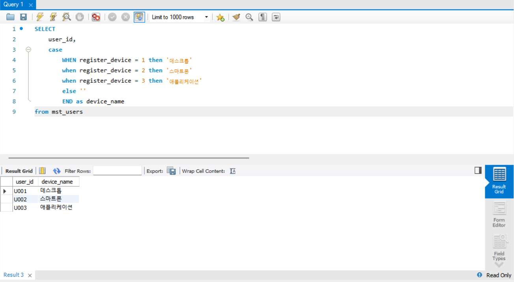
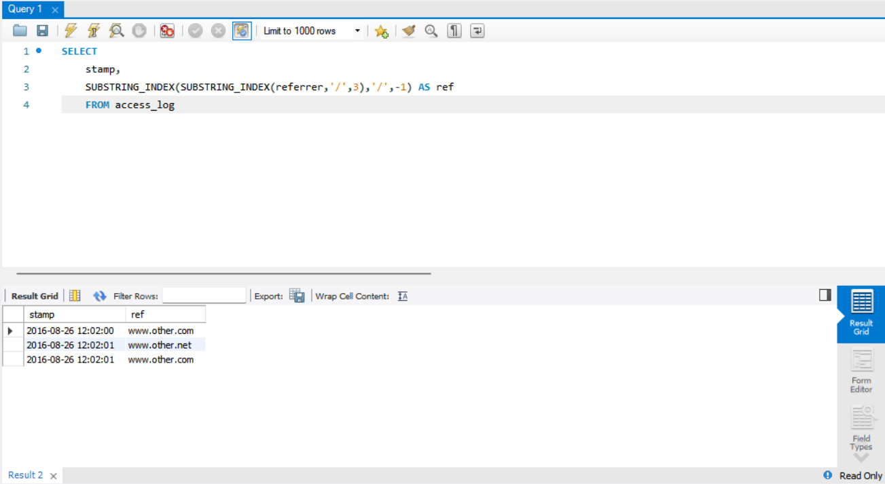
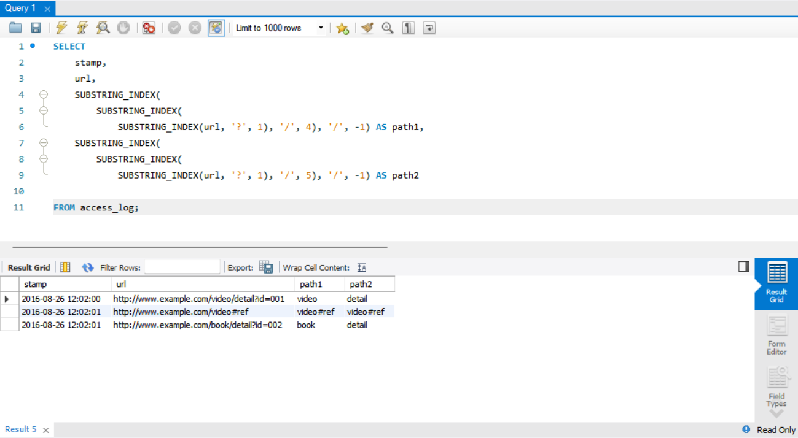
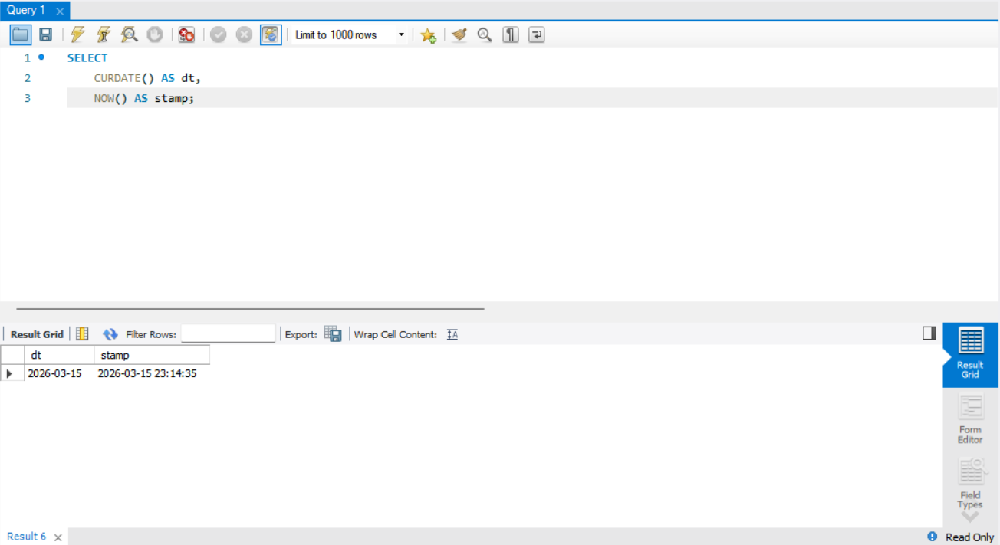
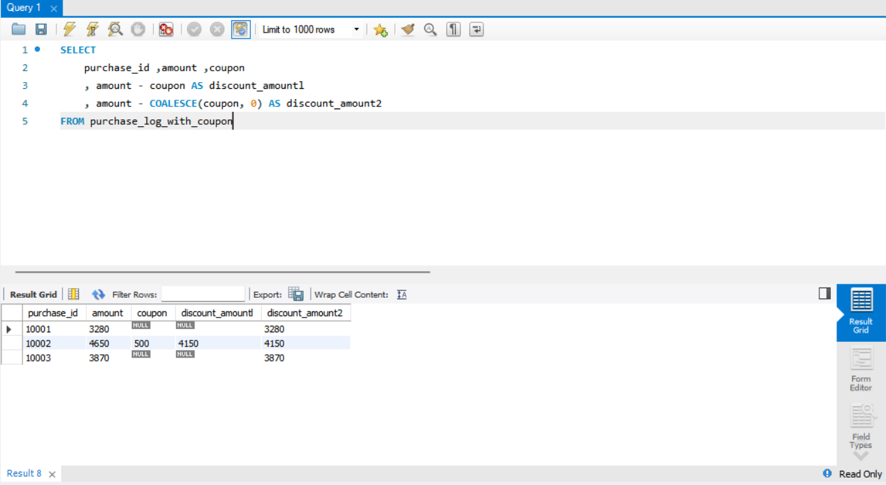
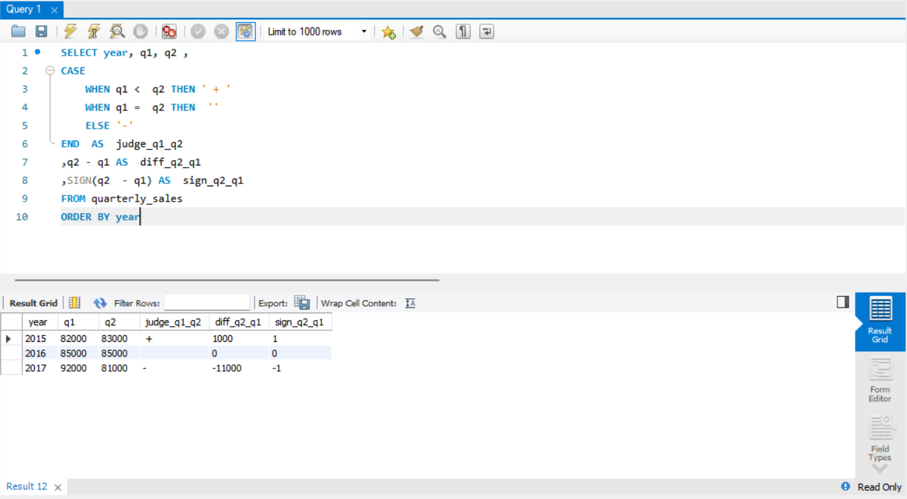
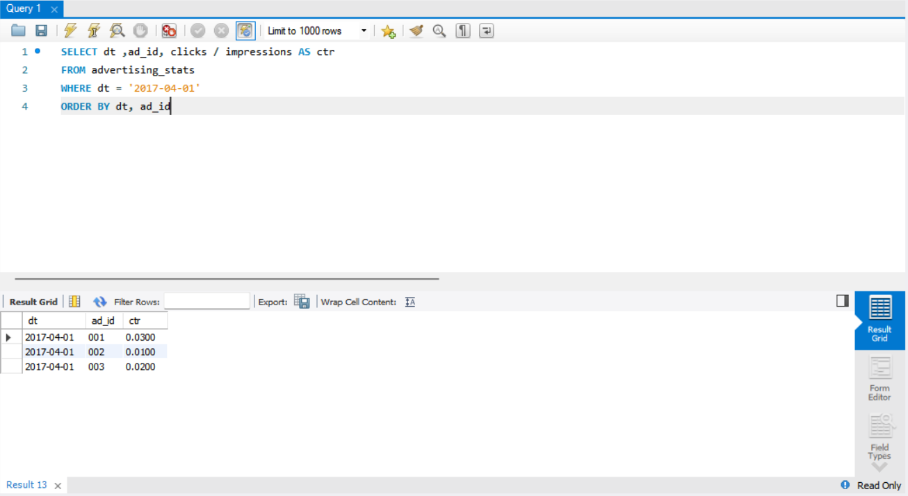

# SQL_MASTER 2주차 정규과제

📌SQL MASTER 정규과제는 매주 정해진 분량의 『*데이터 분석을 위한 SQL 레시피*』 를 읽고 학습하는 것입니다. 이번 주는 아래의 **SQL_MASTER_2nd_TIL**에 나열된 분량을 읽고 공부하시면 됩니다.

아래 실습을 수행하며 학습 내용을 직접 적용해보세요. 단순히 결과를 재현하는 것이 아니라, SQL을 직접 작성하는 과정에서 개념을 스스로 정리하는 것이 중요합니다.

필요한 경우 교재와 추가 자료를 참고하여 이해를 보완하시기 바랍니다.

## SQL_MASTER_2nd_TIL

### 3장 데이터 가공믈 위한 SQL
#### 1. 하나의 값 조작하기
#### 2. 여러 개의 값에 대한 조작
#### 3. 하나의 테이블에 대한 조작
#### 4. 여러 개의 테이블 조작하기


## Study Schedule

| 주차  | 공부 범위     | 완료 여부 |
| ----- | ------------- | --------- |
| 1주차 | p.20~50    | ✅         |
| 2주차 | p.52~136   | ✅         |
| 3주차 | p.138~184  | 🍽️         |
| 4주차 | p.186~232 | 🍽️         |
| 5주차 | p.233~321 | 🍽️         |
| 6주차 | p.324~406 | 🍽️         |
| 7주차 | p.408~464 | 🍽️         |

<br>

<!-- 여기까진 그대로 둬 주세요-->


# 실습

## 0. 실습 규칙

1. 샘플 데이터 생성 코드는 **07_SQL_MASTER_Template/src** 경로에 장별로 정리되어 있습니다.
2. 아래 목차에 맞춰 해당 코드를 실행하여 샘플 데이터를 생성한 후, 각 장에서 요구하는 쿼리를 직접 작성해보시기 바랍니다.
3. 작성한 쿼리의 **실행 결과 화면도 함께 제출**해 주세요.
4. 단순히 교재의 예시 코드를 그대로 작성하는 것이 아니라, **제시된 로직을 충분히 이해한 뒤 교재를 보지 않고 스스로 쿼리를 구성**해보는 것을 권장합니다.
5. 교재 예시는 PostgreSQL, Hive, BigQuery 등 다양한 DBMS 기준으로 제시되어 있기 때문에, **MySQL이 아닌 다른 SQL 환경을 사용하여 실습을 진행해도 무방합니다.**
6. 다만, 사용 중인 DBMS에 맞는 문법으로 적절히 변환하여 작성하시기 바랍니다.

## 1. 하나의 값 조작하기 

### 1-1 코드 값을 레이블로 변경하기

#### CASE WHEN THEN ELSE 구문은 파이썬의 if else 구문과 동일하게 작용한다

```sql
SELECT
	user_id,
    case
    	WHEN register_device = 1 then '데스크톱'
        when register_device = 2 then '스마트폰'
        when register_device = 3 then '애플리케이션'
        else ''
        END as device_name
from mst_users
```



### 1-2 URL에서 요소 추출하기

#### MySQL에서는 SUBSTRING을 쓰는게 좋음!
#### SUBSTRING(문자열, 시작위치, 길이)
#### SUBSTRING_INDEX(문자열, 구분자, 개수) 구분자 기준으로 문자열을 나눈 뒤 앞 또는 뒤에서 N개를 반환

```sql
SELECT
    stamp,
    SUBSTRING_INDEX(SUBSTRING_INDEX(referrer,'/',3),'/',-1) AS ref
    FROM access_log
```




### 1-3 문자열을 배열로 분해하기

#### 문장 특히 url같은경우 쪼개서 사용해야될 경우가 많음 (ex 크롤링 등..)

```sql
SELECT
    stamp,
    url,
    SUBSTRING_INDEX(
        SUBSTRING_INDEX(
            SUBSTRING_INDEX(url, '?', 1), '/', 4), '/', -1) AS path1,
    SUBSTRING_INDEX(
        SUBSTRING_INDEX(
            SUBSTRING_INDEX(url, '?', 1), '/', 5), '/', -1) AS path2
            
FROM access_log;
```




### 1-4 날짜와 타임스탬프 다루기

 - CURDATE - 현재날짜
 - NOW - 현재시간

```sql
SELECT
    CURDATE() AS dt,
    NOW() AS stamp;
```




### 1-5 결손 값을 디폴트 값으로 대치하기

#### sql에서 null은 연산시 결과값을 null로 만들어 데이터를 항상 가공해서 써야함 
 - COALESCE는 여러 값 중 null이 아닌값 반환 -> null 처리 함수

```sql
SELECT
	purchase_id ,amount ,coupon
	, amount - coupon AS discount_amountl
	, amount - COALESCE(coupon, 0) AS discount_amount2
FROM purchase_log_with_coupon
```




## 2. 여러 개의 값에 대한 조작 

### 2-1 문자열을 연결하기

#### 시도명이 다른 컬럼에 존재하는 경우 하나로 처리해서 사용해야되는 경우가 있음

```sql
SELECT
	user_id, 
	CONCAT(pref_name,  city_name) AS  pref_city
FROM mst_user_location
```


### 2-2 여러 개의 값을 비교하기

 - SIGN 함수는 매개변수가 양수라면 1,。이라면 0, 음수라면 -1을 리턴하는 함수

```sql
SELECT year, q1, q2 ,
CASE
	WHEN q1 <  q2 THEN ' + '
	WHEN q1 =  q2 THEN  ''
	ELSE '-'
END  AS  judge_q1_q2
,q2 - q1 AS  diff_q2_q1
,SIGN(q2  - q1) AS  sign_q2_q1
FROM quarterly_sales
ORDER BY year
```




### 2-3 2개의 값 비율 계산하기

 - 정수, 실수형으로 나누기 / 자료형 변환이 자동으로 이뤄짐

```sql
SELECT dt ,ad_id, clicks / impressions AS ctr
FROM advertising_stats
WHERE dt = '2017-04-01'
ORDER BY dt, ad_id
```




### 2-4 두 값의 거리 계산하기

<!-- 이 부분을 지우고 새롭게 배운 내용을 자유롭게 정리해주세요. -->

```sql
여기에 코드를 적어주세요.
```

<!-- 이 부분을 지우고 실행 결과 화면을 제출해주세요. -->

### 2-5 날짜/시간을 계산하기

<!-- 이 부분을 지우고 새롭게 배운 내용을 자유롭게 정리해주세요. -->

```sql
여기에 코드를 적어주세요.
```

<!-- 이 부분을 지우고 실행 결과 화면을 제출해주세요. -->

### 2-6 IP 주소 다루기

<!-- 이 부분을 지우고 새롭게 배운 내용을 자유롭게 정리해주세요. -->

```sql
여기에 코드를 적어주세요.
```

<!-- 이 부분을 지우고 실행 결과 화면을 제출해주세요. -->

## 03. 하나의 테이블에 대한 조작 

### 3-1 그룹의 특징 잡기

<!-- 이 부분을 지우고 새롭게 배운 내용을 자유롭게 정리해주세요. -->

```sql
여기에 코드를 적어주세요.
```

<!-- 이 부분을 지우고 실행 결과 화면을 제출해주세요. -->

### 3-2 그룹 내부의 순서

<!-- 이 부분을 지우고 새롭게 배운 내용을 자유롭게 정리해주세요. -->

```sql
여기에 코드를 적어주세요.
```

<!-- 이 부분을 지우고 실행 결과 화면을 제출해주세요. -->

### 3-3 세로 기반 데이터를 가로 기반으로 변환하기

<!-- 이 부분을 지우고 새롭게 배운 내용을 자유롭게 정리해주세요. -->

```sql
여기에 코드를 적어주세요.
```

<!-- 이 부분을 지우고 실행 결과 화면을 제출해주세요. -->

### 3-4 가로 기반 데이터를 세로 기반으로 변환하기

<!-- 이 부분을 지우고 새롭게 배운 내용을 자유롭게 정리해주세요. -->

```sql
여기에 코드를 적어주세요.
```

<!-- 이 부분을 지우고 실행 결과 화면을 제출해주세요. -->


## 04. 여러 개의 테이블 조작하기

### 4-1 여러 개의 테이블을 세로로 결합하기

<!-- 이 부분을 지우고 새롭게 배운 내용을 자유롭게 정리해주세요. -->

```sql
여기에 코드를 적어주세요.
```

<!-- 이 부분을 지우고 실행 결과 화면을 제출해주세요. -->

### 4-2 여러 개의 테이블을 가로로 정렬하기

<!-- 이 부분을 지우고 새롭게 배운 내용을 자유롭게 정리해주세요. -->

```sql
여기에 코드를 적어주세요.
```

<!-- 이 부분을 지우고 실행 결과 화면을 제출해주세요. -->

### 4-3 조건 플래그를 0과 1로 표현하기

<!-- 이 부분을 지우고 새롭게 배운 내용을 자유롭게 정리해주세요. -->

```sql
여기에 코드를 적어주세요.
```

<!-- 이 부분을 지우고 실행 결과 화면을 제출해주세요. -->

### 4-4 계산한 테이블에 이름 붙여 재사용하기

<!-- 이 부분을 지우고 새롭게 배운 내용을 자유롭게 정리해주세요. -->

```sql
여기에 코드를 적어주세요.
```

<!-- 이 부분을 지우고 실행 결과 화면을 제출해주세요. -->

### 4-5 유사 테이블 만들기

<!-- 이 부분을 지우고 새롭게 배운 내용을 자유롭게 정리해주세요. -->

```sql
여기에 코드를 적어주세요.
```

<!-- 이 부분을 지우고 실행 결과 화면을 제출해주세요. -->


### 🎉 수고하셨습니다.
