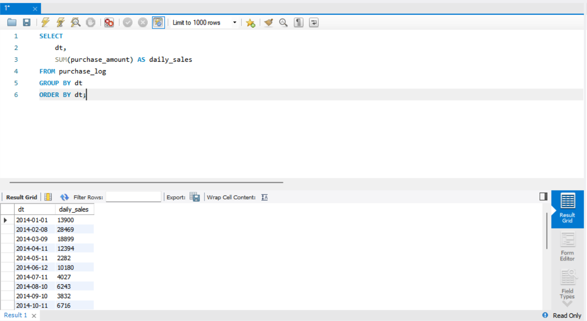
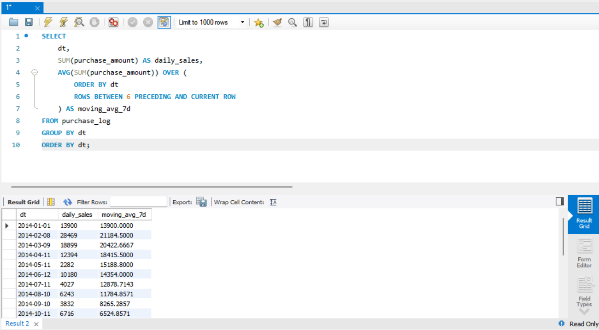
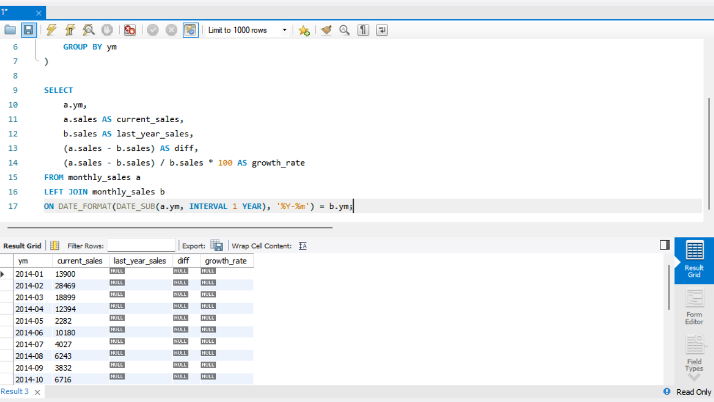
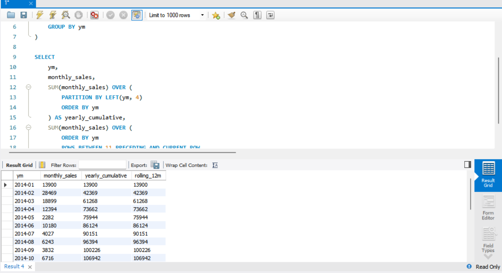
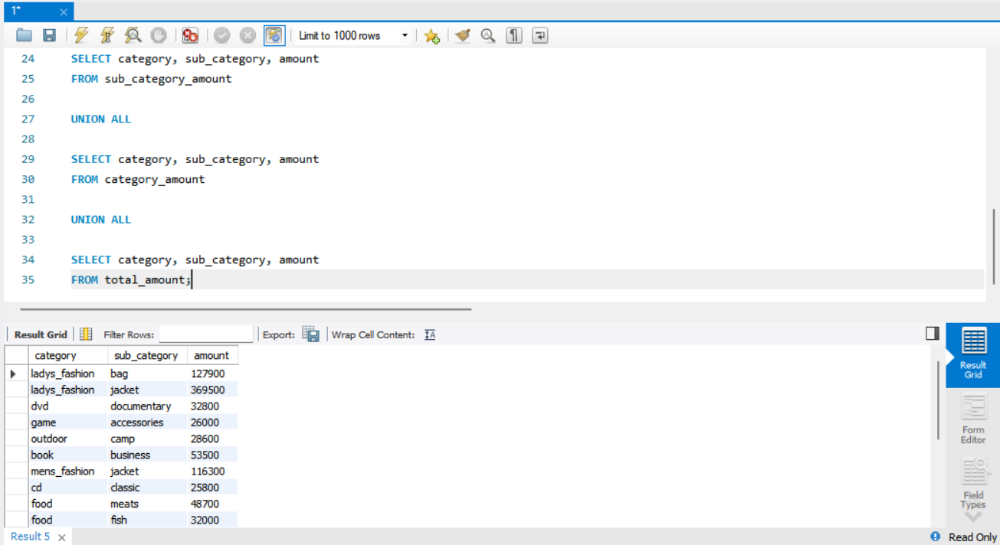
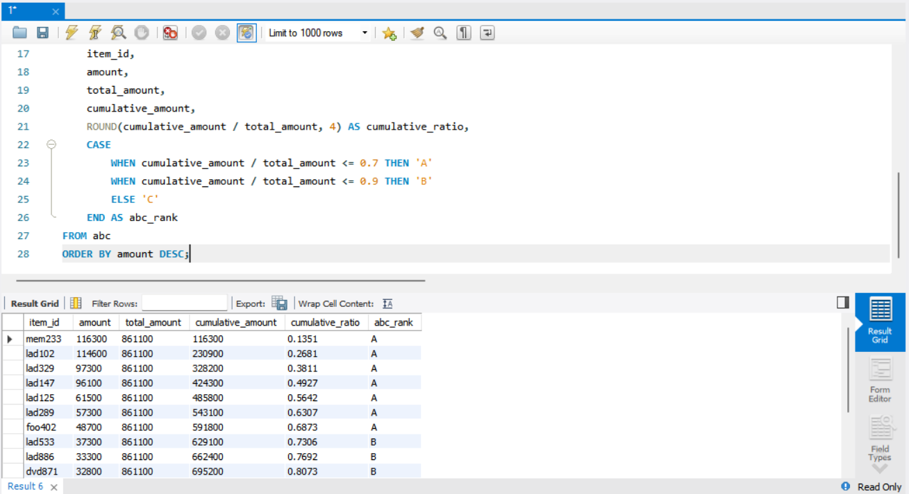
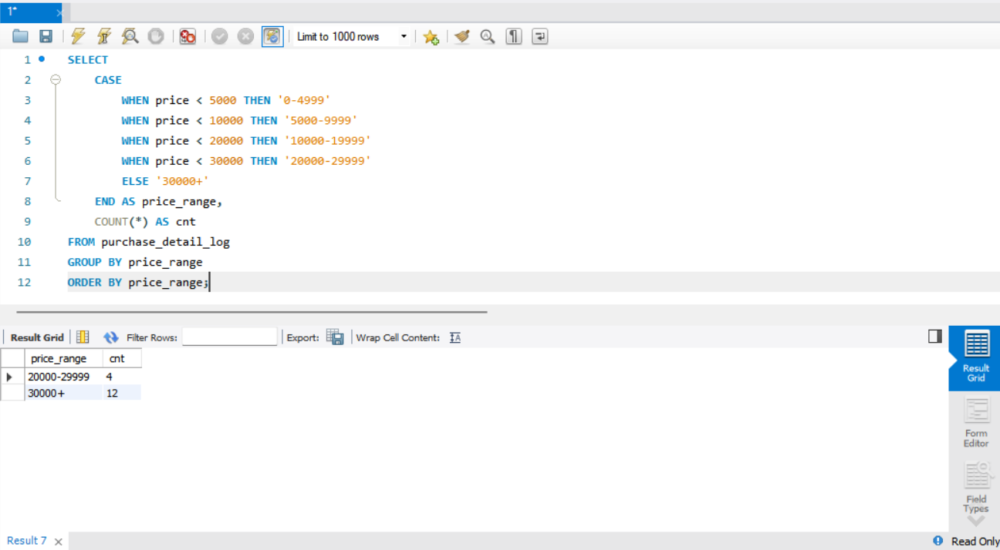

# SQL_MASTER 3주차 정규과제

📌SQL MASTER 정규과제는 매주 정해진 분량의 『*데이터 분석을 위한 SQL 레시피*』 를 읽고 학습하는 것입니다. 이번 주는 아래의 **SQL_MASTER_3rd_TIL**에 나열된 분량을 읽고 공부하시면 됩니다.

아래 실습을 수행하며 학습 내용을 직접 적용해보세요. 단순히 결과를 재현하는 것이 아니라, SQL을 직접 작성하는 과정에서 개념을 스스로 정리하는 것이 중요합니다.

필요한 경우 교재와 추가 자료를 참고하여 이해를 보완하시기 바랍니다.

## SQL_MASTER_3rd_TIL

### 4장 매출을 파악하기 위한 데이터 추출
#### 1. 시계열 기반으로 데이터 집계하기
#### 2. 다면적인 축을 사용해 데이터 집계하기 


## Study Schedule

| 주차  | 공부 범위     | 완료 여부 |
| ----- | ------------- | --------- |
| 1주차 | p.20~50    | ✅         |
| 2주차 | p.52~136   | ✅         |
| 3주차 | p.138~184  | ✅         |
| 4주차 | p.186~232 | 🍽️         |
| 5주차 | p.233~321 | 🍽️         |
| 6주차 | p.324~406 | 🍽️         |
| 7주차 | p.408~464 | 🍽️         |

<br>

<!-- 여기까진 그대로 둬 주세요-->

# 실습

## 0. 실습 규칙

1. 샘플 데이터 생성 코드는 **07_SQL_MASTER_Template/src** 경로에 장별로 정리되어 있습니다.
2. 아래 목차에 맞춰 해당 코드를 실행하여 샘플 데이터를 생성한 후, 각 장에서 요구하는 쿼리를 직접 작성해보시기 바랍니다.
3. 작성한 쿼리의 **실행 결과 화면도 함께 제출**해 주세요.
4. 단순히 교재의 예시 코드를 그대로 작성하는 것이 아니라, **제시된 로직을 충분히 이해한 뒤 교재를 보지 않고 스스로 쿼리를 구성**해보는 것을 권장합니다.
5. 교재 예시는 PostgreSQL, Hive, BigQuery 등 다양한 DBMS 기준으로 제시되어 있기 때문에, **MySQL이 아닌 다른 SQL 환경을 사용하여 실습을 진행해도 무방합니다.**
6. 다만, 사용 중인 DBMS에 맞는 문법으로 적절히 변환하여 작성하시기 바랍니다.


## 1. 시계열 기반으로 데이터 집계하기


### 1-1 날짜별 매출 집계
- 날짜 기준으로 GROUP BY 하여 일별 매출을 계산
- 시계열 분석의 가장 기본 구조
- 이후 이동평균, 누계 분석의 기반 데이터

핵심:
- 시간 단위별 데이터 집계
- SUM / COUNT 활용

```sql
SELECT 
    dt,
    SUM(purchase_amount) AS daily_sales
FROM purchase_log
GROUP BY dt
ORDER BY dt;
```

 
### 1-2 이동평균을 사용한 날짜별 추이 보기

### 1-2 이동평균
- 노이즈 제거를 위한 대표적인 방법
- 최근 n일 평균으로 추세 파악
- 보통 7일 이동평균 사용

핵심:
- 윈도 함수 OVER 사용
- ROWS BETWEEN n PRECEDING
```sql
SELECT 
    dt,
    SUM(purchase_amount) AS daily_sales,
    AVG(SUM(purchase_amount)) OVER (
        ORDER BY dt
        ROWS BETWEEN 6 PRECEDING AND CURRENT ROW
    ) AS moving_avg_7d
FROM purchase_log
GROUP BY dt
ORDER BY dt;
```


 
### 1-3 당월 매출 누계 구하기

### 1-3 당월 누계
- 월 내부에서 누적되는 매출 흐름 확인
- PARTITION BY로 월 단위 분리

핵심:
- 누적합 = SUM() OVER
- 월별 초기화 필요
```sql
SELECT 
    dt,
    DATE_FORMAT(dt, '%Y-%m') AS year_month,
    SUM(purchase_amount) AS daily_sales,
    SUM(SUM(purchase_amount)) OVER (
        PARTITION BY DATE_FORMAT(dt, '%Y-%m')
        ORDER BY dt
    ) AS cumulative_sales
FROM purchase_log
GROUP BY dt
ORDER BY dt;
```

<!-- 이 부분을 지우고 실행 결과 화면을 제출해주세요. -->

### 1-4 월별 매출의 작대비 구하기

### 1-4 작년 대비 (전년 동월 대비)
- 계절성 제거한 비교 방식
- 같은 월끼리 비교

핵심:
- 자기 조인 or 윈도 함수 활용
- 증감률 분석
```sql
WITH monthly_sales AS (
    SELECT 
        DATE_FORMAT(dt, '%Y-%m') AS ym,
        SUM(purchase_amount) AS sales
    FROM purchase_log
    GROUP BY ym
)

SELECT 
    a.ym,
    a.sales AS current_sales,
    b.sales AS last_year_sales,
    (a.sales - b.sales) AS diff,
    (a.sales - b.sales) / b.sales * 100 AS growth_rate
FROM monthly_sales a
LEFT JOIN monthly_sales b
ON DATE_FORMAT(DATE_SUB(a.ym, INTERVAL 1 YEAR), '%Y-%m') = b.ym;
```


 
### 1-5 Z 차트로 업적의 추이 확인하기

- 3가지 지표를 동시에 확인
  - 월 매출
  - 연 누계
  - 이동년계(최근 12개월)

핵심:
- 단기 + 장기 트렌드 동시에 분석
- 계절성 영향 제거
```sql
WITH monthly AS (
    SELECT 
        DATE_FORMAT(dt, '%Y-%m') AS ym,
        SUM(purchase_amount) AS monthly_sales
    FROM purchase_log
    GROUP BY ym
)

SELECT 
    ym,
    monthly_sales,
    SUM(monthly_sales) OVER (
        PARTITION BY LEFT(ym, 4)
        ORDER BY ym
    ) AS yearly_cumulative,
    SUM(monthly_sales) OVER (
        ORDER BY ym
        ROWS BETWEEN 11 PRECEDING AND CURRENT ROW
    ) AS rolling_12m
FROM monthly;
```



 
### 1-6 매출을 파악할 때 중요 포인트 

- 매출만 보면 원인 파악 불가
- 반드시 함께 봐야 하는 지표:
  - 구매 건수
  - 평균 구매액
  - 방문 수

핵심:
- 결과가 아니라 원인 분석
```sql
여기에 코드를 적어주세요.
```

<!-- 이 부분을 지우고 실행 결과 화면을 제출해주세요. -->


## 2. 다면적인 축을 사용해 데이터 집계하기 

### 2-1 카테고리별 매출과 소계 계산하기

- 소분류 + 대분류 + 전체 합계
- ROLLUP / UNION ALL 활용

핵심:
- 계층적 집계
```sql
WITH sub_category_amount AS (
    SELECT
        category,
        sub_category,
        SUM(price) AS amount
    FROM purchase_detail_log
    GROUP BY category, sub_category
),
category_amount AS (
    SELECT
        category,
        'all' AS sub_category,
        SUM(price) AS amount
    FROM purchase_detail_log
    GROUP BY category
),
total_amount AS (
    SELECT
        'all' AS category,
        'all' AS sub_category,
        SUM(price) AS amount
    FROM purchase_detail_log
)
SELECT category, sub_category, amount
FROM sub_category_amount

UNION ALL

SELECT category, sub_category, amount
FROM category_amount

UNION ALL

SELECT category, sub_category, amount
FROM total_amount;
```



### 2-2 ABC 분석으로 잘 팔리는 상품 판별하기

- 매출 기여도 기준 분류

구성:
- A: 상위 70%
- B: 70~90%
- C: 나머지

핵심:
- 누적 비율 계산
```sql
WITH product_sales AS (
    SELECT
        item_id,
        SUM(price) AS amount
    FROM purchase_detail_log
    GROUP BY item_id
),
abc AS (
    SELECT
        item_id,
        amount,
        SUM(amount) OVER () AS total_amount,
        SUM(amount) OVER (ORDER BY amount DESC ROWS UNBOUNDED PRECEDING) AS cumulative_amount
    FROM product_sales
)
SELECT
    item_id,
    amount,
    total_amount,
    cumulative_amount,
    ROUND(cumulative_amount / total_amount, 4) AS cumulative_ratio,
    CASE
        WHEN cumulative_amount / total_amount <= 0.7 THEN 'A'
        WHEN cumulative_amount / total_amount <= 0.9 THEN 'B'
        ELSE 'C'
    END AS abc_rank
FROM abc
ORDER BY amount DESC;
```



### 2-3 팬 차트로 상품의 매출 증가율 확인하기

- 상품별 성장률 비교

핵심:
- 절대값이 아닌 증가율 중심 분석

```sql
여기에 코드를 적어주세요.
```

<!-- 이 부분을 지우고 실행 결과 화면을 제출해주세요. -->

### 2-4 히스토그램으로 구매 가격대 집계하기 

- 구매 금액 분포 분석

핵심:
- 구간(bucket) 생성 후 COUNT
- 가격대별 소비 패턴 파악
```sql
SELECT
    CASE
        WHEN price < 5000 THEN '0-4999'
        WHEN price < 10000 THEN '5000-9999'
        WHEN price < 20000 THEN '10000-19999'
        WHEN price < 30000 THEN '20000-29999'
        ELSE '30000+'
    END AS price_range,
    COUNT(*) AS cnt
FROM purchase_detail_log
GROUP BY price_range
ORDER BY price_range;
```




### 🎉 수고하셨습니다.
