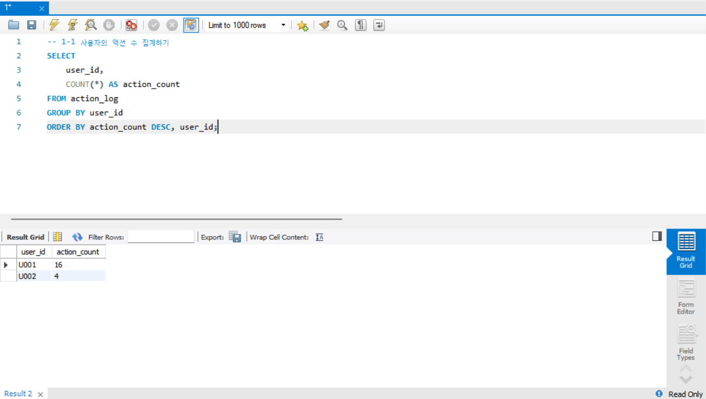
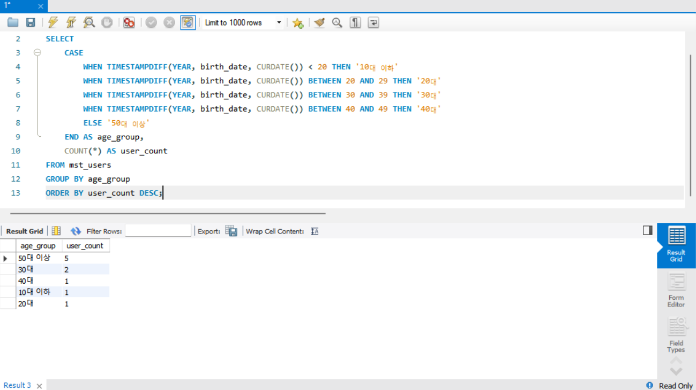
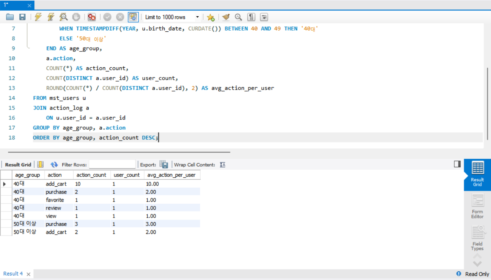
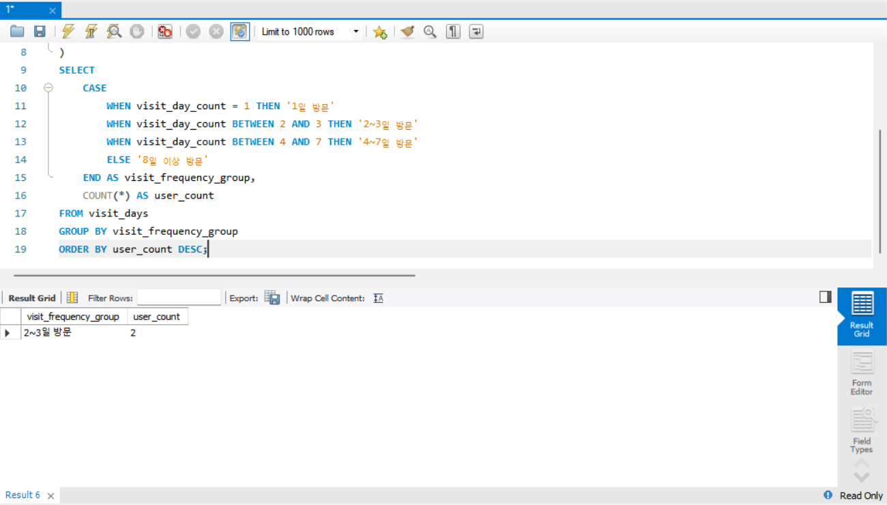
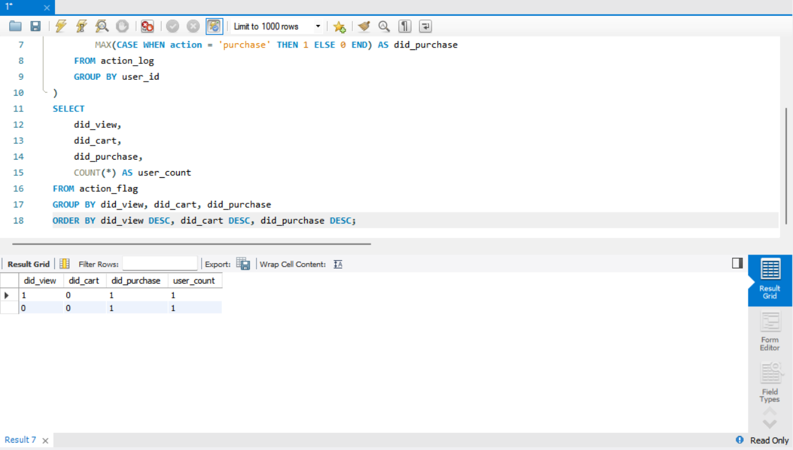
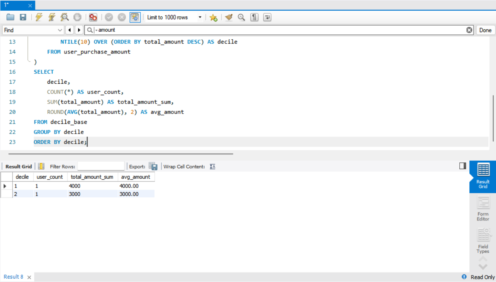
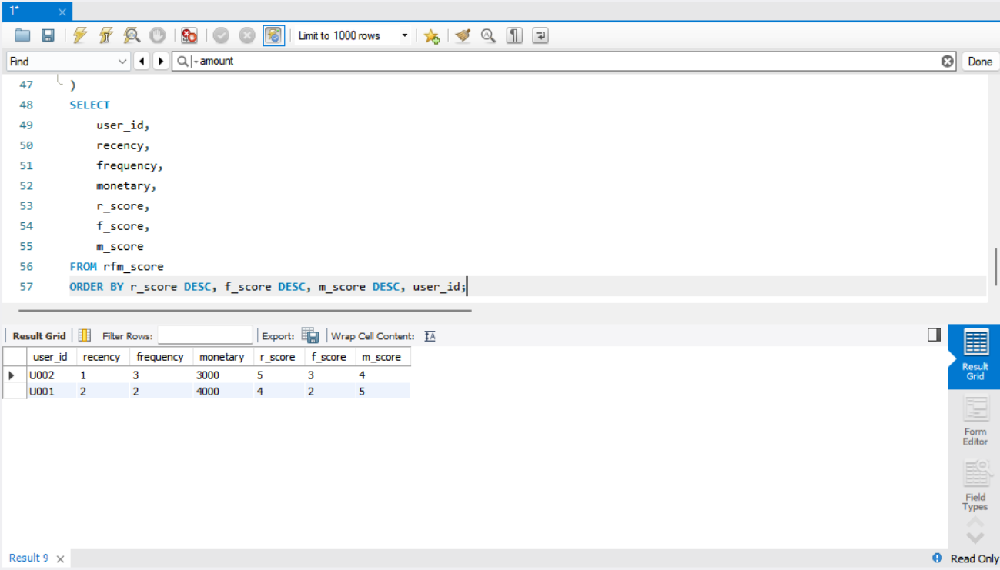

# SQL_MASTER 4주차 정규과제

📌SQL MASTER 정규과제는 매주 정해진 분량의 『*데이터 분석을 위한 SQL 레시피*』 를 읽고 학습하는 것입니다. 이번 주는 아래의 **SQL_MASTER_4th_TIL**에 나열된 분량을 읽고 공부하시면 됩니다.

아래 실습을 수행하며 학습 내용을 직접 적용해보세요. 단순히 결과를 재현하는 것이 아니라, SQL을 직접 작성하는 과정에서 개념을 스스로 정리하는 것이 중요합니다.

필요한 경우 교재와 추가 자료를 참고하여 이해를 보완하시기 바랍니다.

## SQL_MASTER_4th_TIL

### 5장 사용자를 파악하기 위한 데이터 추출
#### 1. 사용자 전체의 특징과 경향 찾기


## Study Schedule

| 주차  | 공부 범위     | 완료 여부 |
| ----- | ------------- | --------- |
| 1주차 | p.20~50    | ✅         |
| 2주차 | p.52~136   | ✅         |
| 3주차 | p.138~184  | ✅         |
| 4주차 | p.186~232 | ✅         |
| 5주차 | p.233~321 | 🍽️         |
| 6주차 | p.324~406 | 🍽️         |
| 7주차 | p.408~464 | 🍽️         |

<br>

<!-- 여기까진 그대로 둬 주세요-->


# 실습

## 0. 실습 규칙

1. 샘플 데이터 생성 코드는 **07_SQL_MASTER_Template/src** 경로에 장별로 정리되어 있습니다.
2. 아래 목차에 맞춰 해당 코드를 실행하여 샘플 데이터를 생성한 후, 각 장에서 요구하는 쿼리를 직접 작성해보시기 바랍니다.
3. 작성한 쿼리의 **실행 결과 화면도 함께 제출**해 주세요.
4. 단순히 교재의 예시 코드를 그대로 작성하는 것이 아니라, **제시된 로직을 충분히 이해한 뒤 교재를 보지 않고 스스로 쿼리를 구성**해보는 것을 권장합니다.
5. 교재 예시는 PostgreSQL, Hive, BigQuery 등 다양한 DBMS 기준으로 제시되어 있기 때문에, **MySQL이 아닌 다른 SQL 환경을 사용하여 실습을 진행해도 무방합니다.**
6. 다만, 사용 중인 DBMS에 맞는 문법으로 적절히 변환하여 작성하시기 바랍니다.

## 1. 사용자 전체의 특징과 경향 찾기

### 1-1 사용자의 액션 수 집계하기

COUNT(*) : 사용자별 전체 액션 수<br>
GROUP BY user_id : 사용자 단위 집계<br>
ORDER BY action_count DESC : 활동량 많은 사용자부터 확인
```sql
SELECT
    user_id,
    COUNT(*) AS action_count
FROM action_log
GROUP BY user_id
ORDER BY action_count DESC, user_id;
```



### 1-2 연령별 구분 집계하기

 - TIMESTAMPDIFF(YEAR, birth_date, CURDATE()) : 현재 기준 만 나이 근사 계산
 - CASE : 연령대를 범주형 변수로 변환
 - 결과는 연령대별 사용자 수 분포 확인용
```sql
SELECT
    CASE
        WHEN TIMESTAMPDIFF(YEAR, birth_date, CURDATE()) < 20 THEN '10대 이하'
        WHEN TIMESTAMPDIFF(YEAR, birth_date, CURDATE()) BETWEEN 20 AND 29 THEN '20대'
        WHEN TIMESTAMPDIFF(YEAR, birth_date, CURDATE()) BETWEEN 30 AND 39 THEN '30대'
        WHEN TIMESTAMPDIFF(YEAR, birth_date, CURDATE()) BETWEEN 40 AND 49 THEN '40대'
        ELSE '50대 이상'
    END AS age_group,
    COUNT(*) AS user_count
FROM mst_users
GROUP BY age_group
ORDER BY user_count DESC;
```


### 1-3 연령별 구분의 특징 추출하기

 - 같은 연령대라도 액션별 강도가 다를 수 있음
 - COUNT(DISTINCT a.user_id) 로 실제 행동한 사용자 수 확인
 - avg_action_per_user 로 연령대별 평균 행동 강도 비교 가능
```sql
SELECT
    CASE
        WHEN TIMESTAMPDIFF(YEAR, u.birth_date, CURDATE()) < 20 THEN '10대 이하'
        WHEN TIMESTAMPDIFF(YEAR, u.birth_date, CURDATE()) BETWEEN 20 AND 29 THEN '20대'
        WHEN TIMESTAMPDIFF(YEAR, u.birth_date, CURDATE()) BETWEEN 30 AND 39 THEN '30대'
        WHEN TIMESTAMPDIFF(YEAR, u.birth_date, CURDATE()) BETWEEN 40 AND 49 THEN '40대'
        ELSE '50대 이상'
    END AS age_group,
    a.action,
    COUNT(*) AS action_count,
    COUNT(DISTINCT a.user_id) AS user_count,
    ROUND(COUNT(*) / COUNT(DISTINCT a.user_id), 2) AS avg_action_per_user
FROM mst_users u
JOIN action_log a
    ON u.user_id = a.user_id
GROUP BY age_group, a.action
ORDER BY age_group, action_count DESC;
```

 
### 1-4 사용자의 방문 빈도 집계하기

 - COUNT(DISTINCT DATE(stamp)) : 방문한 날짜 수
 - 하루에 여러 번 들어와도 1일 방문으로 계산
 - 방문 강도를 범주화해서 해석하기 쉬운 형태로 변환
```sql
WITH visit_days AS (
    SELECT
        user_id,
        COUNT(DISTINCT DATE(stamp)) AS visit_day_count
    FROM action_log
    GROUP BY user_id
)
SELECT
    CASE
        WHEN visit_day_count = 1 THEN '1일 방문'
        WHEN visit_day_count BETWEEN 2 AND 3 THEN '2~3일 방문'
        WHEN visit_day_count BETWEEN 4 AND 7 THEN '4~7일 방문'
        ELSE '8일 이상 방문'
    END AS visit_frequency_group,
    COUNT(*) AS user_count
FROM visit_days
GROUP BY visit_frequency_group
ORDER BY user_count DESC;
```


### 1-5 벤 다이어그램으로 사용자 액션 집계하기

 - MAX(CASE WHEN ... THEN 1 ELSE 0 END) : 액션 수행 여부 플래그화
 - 조합별 사용자 수를 보면 퍼널 구조도 간접적으로 확인 가능
 - 예: 1, 1, 1 이면 view/cart/purchase 모두 수행한 사용자
```sql
WITH action_flag AS (
    SELECT
        user_id,
        MAX(CASE WHEN action = 'view' THEN 1 ELSE 0 END) AS did_view,
        MAX(CASE WHEN action = 'cart' THEN 1 ELSE 0 END) AS did_cart,
        MAX(CASE WHEN action = 'purchase' THEN 1 ELSE 0 END) AS did_purchase
    FROM action_log
    GROUP BY user_id
)
SELECT
    did_view,
    did_cart,
    did_purchase,
    COUNT(*) AS user_count
FROM action_flag
GROUP BY did_view, did_cart, did_purchase
ORDER BY did_view DESC, did_cart DESC, did_purchase DESC;
```


### 1-6 Decile 분석을 사용해 사용자를 10단계 그룹으로 나누기

 - NTILE(10) : 사용자들을 10개 그룹으로 분할
 - decile = 1 이 가장 높은 구매 금액 그룹
 - 그룹별 총매출과 평균매출을 함께 보면 상위 고객 쏠림 정도 파악 가능
```sql
WITH user_purchase_amount AS (
    SELECT
        user_id,
        SUM(amount) AS total_amount
    FROM action_log
    WHERE action = 'purchase'
    GROUP BY user_id
),
decile_base AS (
    SELECT
        user_id,
        total_amount,
        NTILE(10) OVER (ORDER BY total_amount DESC) AS decile
    FROM user_purchase_amount
)
SELECT
    decile,
    COUNT(*) AS user_count,
    SUM(total_amount) AS total_amount_sum,
    ROUND(AVG(total_amount), 2) AS avg_amount
FROM decile_base
GROUP BY decile
ORDER BY decile;
```


### 1-7 RFM 분석으로 사용자를 3가지 관점의 그룹으로 나누기

 - MAX(purchase_date) : 가장 최근 구매일
 - COUNT(*) : 구매 빈도
 - SUM(amount) : 누적 구매 금액
```sql
WITH purchase_base AS (
    SELECT
        user_id,
        DATE(MAX(stamp)) AS recent_purchase_date,
        COUNT(*) AS frequency,
        SUM(amount) AS monetary
    FROM action_log
    WHERE action = 'purchase'
    GROUP BY user_id
),
rfm_base AS (
    SELECT
        user_id,
        DATEDIFF('2016-11-05', recent_purchase_date) AS recency,
        frequency,
        monetary
    FROM purchase_base
),
rfm_score AS (
    SELECT
        user_id,
        recency,
        frequency,
        monetary,
        CASE
            WHEN recency <= 1 THEN 5
            WHEN recency <= 2 THEN 4
            WHEN recency <= 3 THEN 3
            WHEN recency <= 5 THEN 2
            ELSE 1
        END AS r_score,
        CASE
            WHEN frequency >= 5 THEN 5
            WHEN frequency = 4 THEN 4
            WHEN frequency = 3 THEN 3
            WHEN frequency = 2 THEN 2
            ELSE 1
        END AS f_score,
        CASE
            WHEN monetary >= 4000 THEN 5
            WHEN monetary >= 3000 THEN 4
            WHEN monetary >= 2000 THEN 3
            WHEN monetary >= 1000 THEN 2
            ELSE 1
        END AS m_score
    FROM rfm_base
)
SELECT
    user_id,
    recency,
    frequency,
    monetary,
    r_score,
    f_score,
    m_score
FROM rfm_score
ORDER BY r_score DESC, f_score DESC, m_score DESC, user_id;
```



### 🎉 수고하셨습니다.
