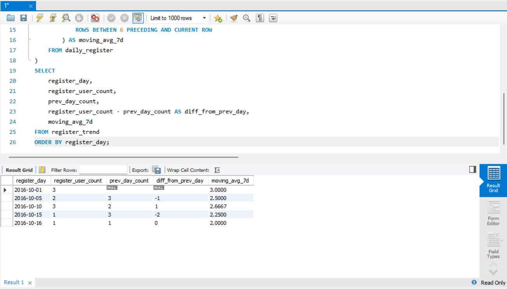
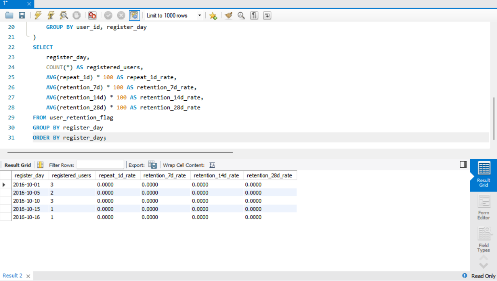
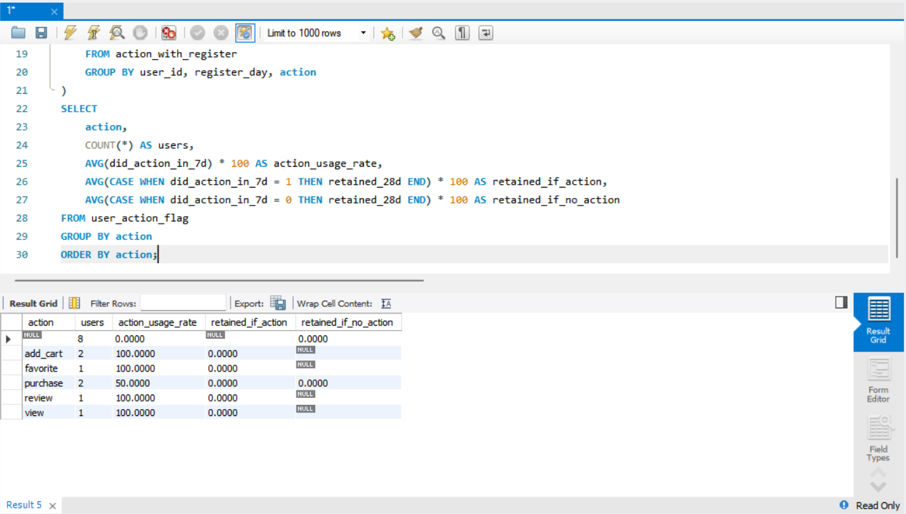
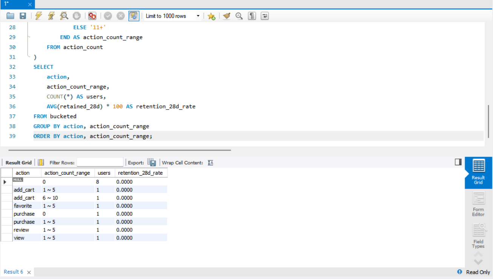
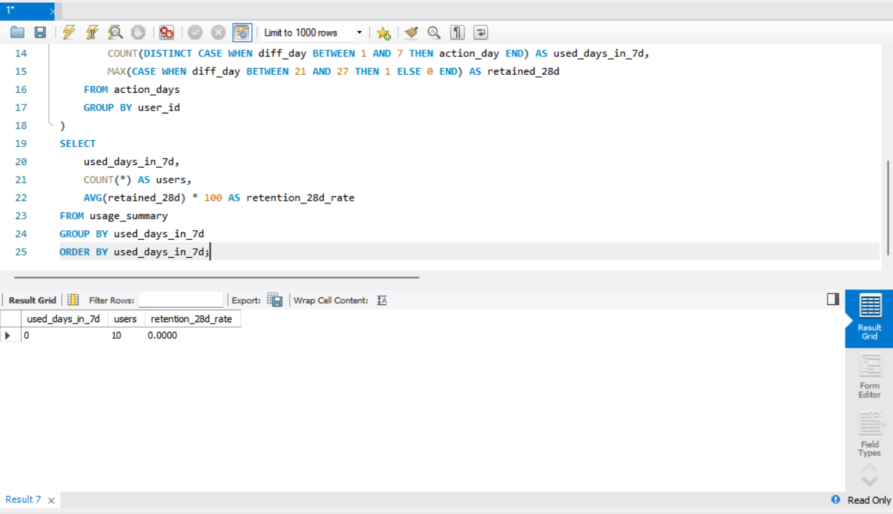
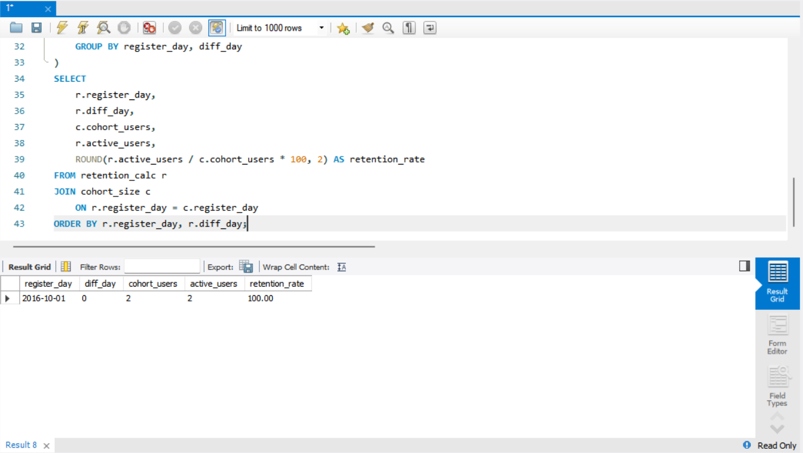
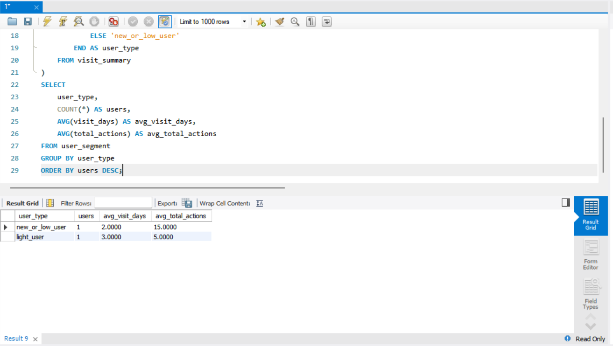
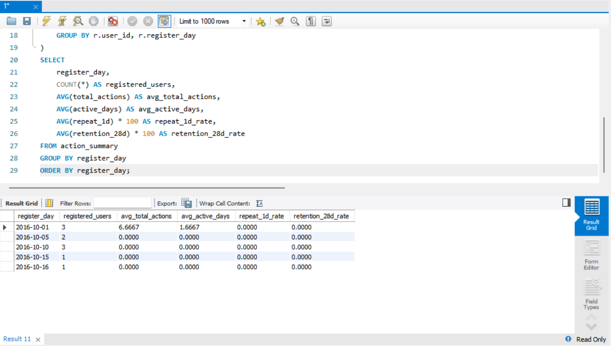
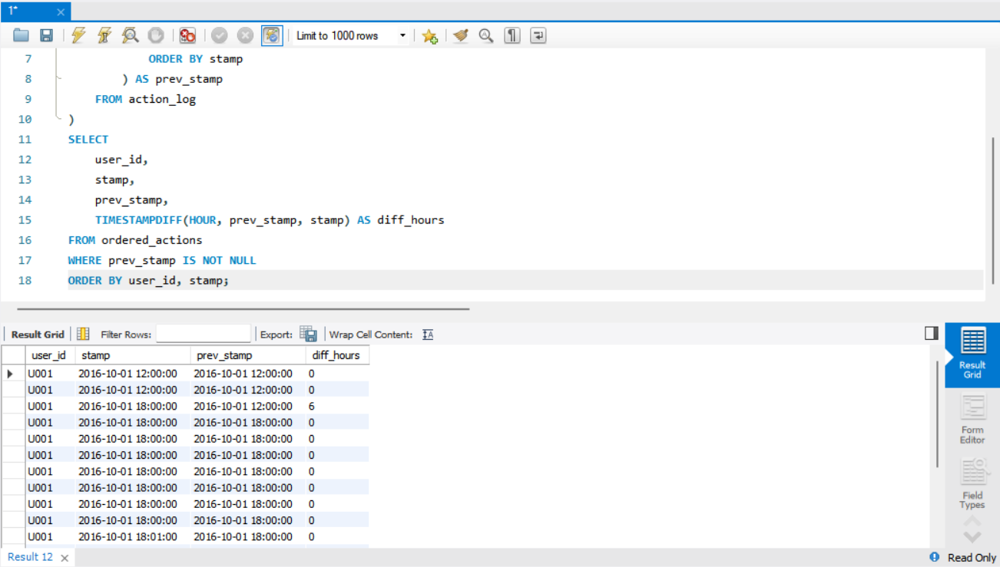

# SQL_MASTER 6주차 정규과제

📌SQL MASTER 정규과제는 매주 정해진 분량의 『*데이터 분석을 위한 SQL 레시피*』 를 읽고 학습하는 것입니다. 이번 주는 아래의 **SQL_MASTER_6th_TIL**에 나열된 분량을 읽고 공부하시면 됩니다.

아래 실습을 수행하며 학습 내용을 직접 적용해보세요. 단순히 결과를 재현하는 것이 아니라, SQL을 직접 작성하는 과정에서 개념을 스스로 정리하는 것이 중요합니다.

필요한 경우 교재와 추가 자료를 참고하여 이해를 보완하시기 바랍니다.

## SQL_MASTER_6th_TIL

### 6장 웹사이트에서의 행동을 파악하는 데이터 추출하기
#### 1. 사이트 전체의 특징/경향 찾기
#### 2. 사이트 내의 사용자 행동 파악하기
#### 3. 입력 양식 최적화하기 


## Study Schedule

| 주차  | 공부 범위     | 완료 여부 |
| ----- | ------------- | --------- |
| 1주차 | p.20~50    | ✅         |
| 2주차 | p.52~136   | ✅         |
| 3주차 | p.138~184  | ✅         |
| 4주차 | p.186~232 | ✅         |
| 5주차 | p.233~321 | ✅         |
| 6주차 | p.324~406 | ✅         |
| 7주차 | p.408~464 | 🍽️         |

<br>

<!-- 여기까진 그대로 둬 주세요-->


# 실습

## 0. 실습 규칙

1. 샘플 데이터 생성 코드는 **07_SQL_MASTER_Template/src** 경로에 장별로 정리되어 있습니다.
2. 아래 목차에 맞춰 해당 코드를 실행하여 샘플 데이터를 생성한 후, 각 장에서 요구하는 쿼리를 직접 작성해보시기 바랍니다.
3. 작성한 쿼리의 **실행 결과 화면도 함께 제출**해 주세요.
4. 단순히 교재의 예시 코드를 그대로 작성하는 것이 아니라, **제시된 로직을 충분히 이해한 뒤 교재를 보지 않고 스스로 쿼리를 구성**해보는 것을 권장합니다.
5. 교재 예시는 PostgreSQL, Hive, BigQuery 등 다양한 DBMS 기준으로 제시되어 있기 때문에, **MySQL이 아닌 다른 SQL 환경을 사용하여 실습을 진행해도 무방합니다.**
6. 다만, 사용 중인 DBMS에 맞는 문법으로 적절히 변환하여 작성하시기 바랍니다.

## 1. 사이트 전체의 특징/경향 찾기

### 1-1 날짜별 방문자 수 / 방문 횟수 / 페이지 뷰 집계하기

<!-- 이 부분을 지우고 새롭게 배운 내용을 자유롭게 정리해주세요. -->

```sql
SELECT
    CAST(stamp AS DATE) AS dt,
    COUNT(DISTINCT user_id) AS users,
    COUNT(DISTINCT session_id) AS visits,
    COUNT(*) AS page_views
FROM access_log
GROUP BY CAST(stamp AS DATE)
ORDER BY dt;
```



### 1-2 페이지별 쿠키 / 방문 횟수 / 페이지 뷰 집계하기

<!-- 이 부분을 지우고 새롭게 배운 내용을 자유롭게 정리해주세요. -->

```sql
SELECT
    CAST(stamp AS DATE) AS dt,
    COUNT(DISTINCT user_id) AS users,
    COUNT(DISTINCT session_id) AS visits,
    COUNT(*) AS page_views
FROM access_log
GROUP BY CAST(stamp AS DATE)
ORDER BY dt;
```


### 1-3 유입원별로 방문 횟수 또는 CVR 집계하기

<!-- 이 부분을 지우고 새롭게 배운 내용을 자유롭게 정리해주세요. -->

```sql
SELECT
    COALESCE(referrer, 'direct') AS source,
    COUNT(DISTINCT session_id) AS visits,
    SUM(CASE WHEN action = 'purchase' THEN 1 ELSE 0 END) AS conversions,
    ROUND(
        SUM(CASE WHEN action = 'purchase' THEN 1 ELSE 0 END) * 100.0
        / COUNT(DISTINCT session_id),
        2
    ) AS cvr
FROM access_log
GROUP BY COALESCE(referrer, 'direct')
ORDER BY visits DESC;
```

 
### 1-4 접근 요일,시간대 파악하기

<!-- 이 부분을 지우고 새롭게 배운 내용을 자유롭게 정리해주세요. -->

```sql
SELECT
    EXTRACT(DOW FROM stamp) AS day_of_week,
    EXTRACT(HOUR FROM stamp) AS hour,
    COUNT(*) AS page_views,
    COUNT(DISTINCT session_id) AS visits
FROM access_log
GROUP BY
    EXTRACT(DOW FROM stamp),
    EXTRACT(HOUR FROM stamp)
ORDER BY day_of_week, hour;
```



## 2. 사이트 내의 사용자 행동 파악하기 

### 2-1 입구 페이지와 출구 페이지 파악하기

<!-- 이 부분을 지우고 새롭게 배운 내용을 자유롭게 정리해주세요. -->

```sql
WITH page_order AS (
    SELECT
        session_id,
        path,
        stamp,
        ROW_NUMBER() OVER(PARTITION BY session_id ORDER BY stamp) AS first_order,
        ROW_NUMBER() OVER(PARTITION BY session_id ORDER BY stamp DESC) AS last_order
    FROM access_log
)
SELECT
    path,
    SUM(CASE WHEN first_order = 1 THEN 1 ELSE 0 END) AS entrances,
    SUM(CASE WHEN last_order = 1 THEN 1 ELSE 0 END) AS exits
FROM page_order
GROUP BY path
ORDER BY entrances DESC;
```


### 2-2 이탈률과 직귀율 계산하기

<!-- 이 부분을 지우고 새롭게 배운 내용을 자유롭게 정리해주세요. -->

```sql
WITH page_order AS (
    SELECT
        session_id,
        path,
        stamp,
        COUNT(*) OVER(PARTITION BY session_id) AS session_pageviews,
        ROW_NUMBER() OVER(PARTITION BY session_id ORDER BY stamp DESC) AS last_order
    FROM access_log
),
page_summary AS (
    SELECT
        path,
        COUNT(*) AS page_views,
        SUM(CASE WHEN last_order = 1 THEN 1 ELSE 0 END) AS exits,
        SUM(CASE WHEN session_pageviews = 1 THEN 1 ELSE 0 END) AS bounces
    FROM page_order
    GROUP BY path
)
SELECT
    path,
    page_views,
    exits,
    ROUND(exits * 100.0 / page_views, 2) AS exit_rate,
    bounces,
    ROUND(bounces * 100.0 / page_views, 2) AS bounce_rate
FROM page_summary
ORDER BY exit_rate DESC;
```


### 2-3 성과로 이어지는 페이지 파악하기 

<!-- 이 부분을 지우고 새롭게 배운 내용을 자유롭게 정리해주세요. -->

```sql
WITH conversion_sessions AS (
    SELECT DISTINCT session_id
    FROM access_log
    WHERE action = 'purchase'
)
SELECT
    a.path,
    COUNT(*) AS page_views_before_conversion,
    COUNT(DISTINCT a.session_id) AS conversion_sessions
FROM access_log AS a
JOIN conversion_sessions AS c
    ON a.session_id = c.session_id
GROUP BY a.path
ORDER BY conversion_sessions DESC;
```


### 2-4 페이지 가치 산출하기 

<!-- 이 부분을 지우고 새롭게 배운 내용을 자유롭게 정리해주세요. -->

```sql
WITH conversion_sessions AS (
    SELECT
        session_id,
        MAX(amount) AS conversion_amount
    FROM access_log
    WHERE action = 'purchase'
    GROUP BY session_id
),
view_pages AS (
    SELECT DISTINCT
        session_id,
        path
    FROM access_log
),
page_value AS (
    SELECT
        v.path,
        SUM(c.conversion_amount) AS total_conversion_amount,
        COUNT(DISTINCT v.session_id) AS related_sessions
    FROM view_pages AS v
    JOIN conversion_sessions AS c
        ON v.session_id = c.session_id
    GROUP BY v.path
)
SELECT
    path,
    total_conversion_amount,
    related_sessions,
    ROUND(total_conversion_amount * 1.0 / related_sessions, 2) AS page_value
FROM page_value
ORDER BY page_value DESC;
```


### 2-5 검색 조건들의 사용자 행동 가시화하기 

<!-- 이 부분을 지우고 새롭게 배운 내용을 자유롭게 정리해주세요. -->

```sql
SELECT
    search_keyword,
    COUNT(DISTINCT session_id) AS visits,
    COUNT(*) AS searches,
    SUM(CASE WHEN action = 'purchase' THEN 1 ELSE 0 END) AS conversions
FROM access_log
WHERE search_keyword IS NOT NULL
GROUP BY search_keyword
ORDER BY searches DESC;
```


### 2-6 폴아웃 리포트를 사용해 사용자 회유를 가시화하기 

<!-- 이 부분을 지우고 새롭게 배운 내용을 자유롭게 정리해주세요. -->

```sql
WITH access_with_next AS (
    SELECT
        session_id,
        path AS current_path,
        LEAD(path) OVER(PARTITION BY session_id ORDER BY stamp) AS next_path
    FROM access_log
)
SELECT
    current_path,
    next_path,
    COUNT(*) AS transition_count
FROM access_with_next
WHERE next_path IS NOT NULL
GROUP BY current_path, next_path
ORDER BY transition_count DESC;
```


### 2-7 사이트 내부에서 사용자 흐름 파악하기 

<!-- 이 부분을 지우고 새롭게 배운 내용을 자유롭게 정리해주세요. -->

```sql
SELECT
    path,
    COUNT(*) AS page_views,
    SUM(
        CASE
            WHEN scroll_height >= page_height * 0.9 THEN 1
            ELSE 0
        END
    ) AS read_complete_count,
    ROUND(
        SUM(
            CASE
                WHEN scroll_height >= page_height * 0.9 THEN 1
                ELSE 0
            END
        ) * 100.0 / COUNT(*),
        2
    ) AS read_complete_rate
FROM access_log
WHERE page_height IS NOT NULL
  AND scroll_height IS NOT NULL
GROUP BY path
ORDER BY read_complete_rate DESC;
```


### 2-8 페이지 완독률 집계하기 

<!-- 이 부분을 지우고 새롭게 배운 내용을 자유롭게 정리해주세요. -->

```sql
SELECT
    session_id,
    STRING_AGG(path, ' -> ' ORDER BY stamp) AS user_flow
FROM access_log
GROUP BY session_id
ORDER BY session_id;
```

<!-- 이 부분을 지우고 실행 결과 화면을 제출해주세요. -->

### 2-9 사용자 행동 전체를 시각화하기 

<!-- 이 부분을 지우고 새롭게 배운 내용을 자유롭게 정리해주세요. -->

```sql
여기에 코드를 적어주세요.
```

<!-- 이 부분을 지우고 실행 결과 화면을 제출해주세요. -->

## 3. 입력 양식 최적화하기 

### 3-1 오류율 집계하기 

<!-- 이 부분을 지우고 새롭게 배운 내용을 자유롭게 정리해주세요. -->

```sql
SELECT
    path,
    COUNT(*) AS total_count,
    SUM(CASE WHEN status = 'error' THEN 1 ELSE 0 END) AS error_count,
    ROUND(
        SUM(CASE WHEN status = 'error' THEN 1 ELSE 0 END) * 100.0 / COUNT(*),
        2
    ) AS error_rate
FROM form_log
GROUP BY path
ORDER BY error_rate DESC;
```


### 3-2 입력 ~ 확인 ~ 완료까지의 이동률 집계하기 

<!-- 이 부분을 지우고 새롭게 배운 내용을 자유롭게 정리해주세요. -->

```sql
WITH mst_step AS (
    SELECT 1 AS step, 'input' AS status
    UNION ALL SELECT 2, 'confirm'
    UNION ALL SELECT 3, 'complete'
),
session_step AS (
    SELECT DISTINCT
        f.session_id,
        m.step,
        m.status
    FROM form_log AS f
    JOIN mst_step AS m
        ON f.status = m.status
),
step_summary AS (
    SELECT
        step,
        status,
        COUNT(DISTINCT session_id) AS sessions
    FROM session_step
    GROUP BY step, status
)
SELECT
    step,
    status,
    sessions,
    ROUND(
        sessions * 100.0 / FIRST_VALUE(sessions) OVER(ORDER BY step),
        2
    ) AS rate_from_input
FROM step_summary
ORDER BY step;
```


### 3-3 입력 양식 직귀율 집계하기 

<!-- 이 부분을 지우고 새롭게 배운 내용을 자유롭게 정리해주세요. -->

```sql
WITH session_count AS (
    SELECT
        session_id,
        COUNT(*) AS page_count,
        MAX(CASE WHEN status = 'input' THEN 1 ELSE 0 END) AS has_input,
        MAX(CASE WHEN status = 'confirm' THEN 1 ELSE 0 END) AS has_confirm,
        MAX(CASE WHEN status = 'complete' THEN 1 ELSE 0 END) AS has_complete
    FROM form_log
    GROUP BY session_id
)
SELECT
    COUNT(*) AS input_sessions,
    SUM(
        CASE
            WHEN has_input = 1
             AND has_confirm = 0
             AND has_complete = 0
            THEN 1 ELSE 0
        END
    ) AS bounce_sessions,
    ROUND(
        SUM(
            CASE
                WHEN has_input = 1
                 AND has_confirm = 0
                 AND has_complete = 0
                THEN 1 ELSE 0
            END
        ) * 100.0 / COUNT(*),
        2
    ) AS form_bounce_rate
FROM session_count
WHERE has_input = 1;
```


### 3-4 오류가 발생하는 항목과 내용 집계하기 

<!-- 이 부분을 지우고 새롭게 배운 내용을 자유롭게 정리해주세요. -->

```sql
여기에 코드를 적어주세요.
```

<!-- 이 부분을 지우고 실행 결과 화면을 제출해주세요. -->


### 🎉 수고하셨습니다.
